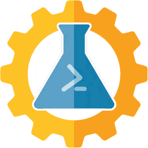

# AutomatedLab.Common

This repository collects helper functions from different areas like DSC, Networking, PKI, ... for use in your infrastructure. Our module AutomatedLab heavily relies on these cmdlets as well.

Starting with version 2, AutomatedLab.Common will support PowerShell Core. Please apply common sense and don't expect Windows-only functionality to work in Linux. Otherwise, all cmdlets have been tested in Windows as well as Linux and should work in general.

## Status

Our current build status of master and develop:

| AppVeyor (master)        | AppVeyor (develop)       |
|--------------------------|--------------------------|
| [![master-image][]][master-site] | [![develop-image][]][master-site] |

[master-image]: https://ci.appveyor.com/api/projects/status/l6r33lbrxkcu76kw/branch/master?svg=true
[develop-image]: https://ci.appveyor.com/api/projects/status/l6r33lbrxkcu76kw/branch/develop?svg=true
[master-site]: https://ci.appveyor.com/project/AutomatedLab/AutomatedLab-Common

## Common

Our common cmdlets include adding modules, functions and variables to PowerShell sessions, enabling the ?? operator, synchronizing cmdlet parameters and many more.

- Add-AccountPrivilege: Adds extended privileges like e.g. LogonAsService for one or more accounts
- Add-FunctionToPSSession: Adds one or more functions to PowerShell sessions - never change your scripts again
- Add-StringIncrement: Increments a string like "Adapter 1" to "Adapter 2"
- Add-VariableToPSSession: Adds one or more variables to PowerShell sessions - never change your scripts again
- Get-ConsoleText: returns the currently visible console buffer or script file to e.g. copy everything
- Get-FullMesh: Returns a mesh for a given list of items, e.g. to aid with DNS forwarder creation
- Get-StringSection: Dissects a string into sections of a configurable size
- Get-Type: Returns a generic type
- Install-SoftwarePackage: Installs an EXE, MSI or MSU with support for moving the installation to a scheduled task to work with installers communicating to Windows Update
- Invoke-Ternary: the ?? operator implementation
- Send-ModuleToPSSession: Sends one or more modules to remote sessions
- Sync-Parameter: Sync parameters for cmdlets, e.g. to sync PSBoundParameters with a cmdlet that might not take all PSBoundParameters thus throwing an error
- Test-HashtableKeys: Tests a hashtable for the existence of keys
- Test-IsAdministrator: Tests if the current user is administrator

## Dsc

Our DSC cmdlets contain functionality related to DSC.

- Get-DscConfigurationImportedResource: Returns a list of imported resources in a given DSC configuration

## Networking

Our networking cmdlets contain everything necessary to make network calculations and so on.

- ConvertTo-BinaryIp: Converts a given IP address to binary notation
- ConvertTo-DecimalIp: Converts a given IP address to decimal notation
- ConvertTo-DottedDecimalIp: Converts a given IP address to Dotted Decimal
- ConvertTo-Mask: Converts an integer (0-32) to a dotted subnet mask, e.g. 255.0.0.0
- ConvertTo-MaskLength: Converts a dotted subnet mask to an integer
- Get-BroadCastAddress: Returns the broadcast address of a given network
- Get-NetworkAddress: Returns the network address of a given network
- Get-NetworkRange: Returns the usable range of addresses of a given network
- Get-NetworkSummary: Combines several cmdlets to return a summarized info object for a given IP and net mask
- Get-PublicIpAddress: Returns the public IP address of the lab host
- Test-Port: Tests a TCP or UDP port with configurable timeouts

## Active Directory Certificate Services (PKI)

Our PKI cmdlets make configurations, certificate requests and duplicating templates a lot easier.

- Add-CATemplateStandardPermissions: Permits one or more sam accounts to auto-enroll and enroll for certificates
- Add-Certificate2: Import a certificate into a store
- Enable-AutoEnrollment: Leverages Group Policy to configure auto-enrollment
- Find-CertificateAuthority: Leverages the Active Directory to locate a CA
- Get-CaTemplate: Leverages the Active Directory to locate a template provided by the CA
- Get-Certificate2: Finds a certificate in a store
- Get-NextOid: Returns an incremented OID
- New-CaTemplate: Duplicate a template with custom settings
- Publish-CaTemplate: Publish a template
- Request-Certificate: Request a new certificate from the CA
- Test-CaTemplate: Uses certutil to check if a template exists

## CI/CD (Team Foundation Server, Azure DevOps (Server))

Our CI/CD cmdlets make interaction with Team Foundation Server starting with 2015 a breeze. Just be sure
to select the API version matching your edition of TFS or Azure DevOps.

- Get-TfsAccessTokenString: Get the Authorization header string for your PAT
- Get-TfsAgentPool: Retrieve TFS/Azure DevOps agent pools for an instance
- Get-TfsAgentQueue: Retrieve a TFS/Azure DevOps Project's agent queue
- Get-TfsBuildDefinition: Retrieve a build definition
- Get-TfsBuildDefinitionTemplate: Retrieve the available build templates of a project
- Get-TfsBuildStep: List all possible build steps to use in a build definition
- Get-TfsGitRepository: Get the GIT repo of a project
- Get-TfsProcessTemplate: Get all possible process templates
- Get-TfsProject: Get a list of Projects or an individual project
- Get-TfsReleaseDefinition: Retrieve a release definition
- Get-TfsReleaseStep: Get a list of possible release steps
- New-TfsAgentQueue: Create a new agent queue from a pool of agents
- New-TfsBuildDefinition: Create a new build pipeline
- New-TfsProject: Create a new team project
- New-TfsReleaseDefinition: Create a new release pipeline
- Set-TfsProject: Modify a project configuration
